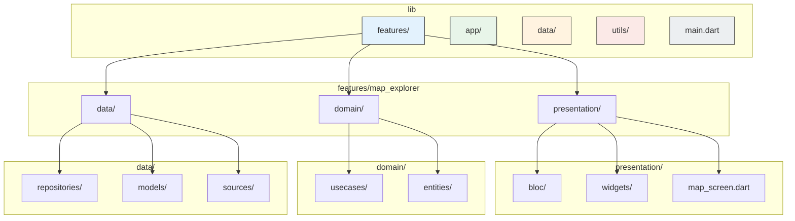

# 🏗️ Project Structure

This document outlines the feature-driven directory structure used for the Social Exploration Game. This structure is based on the principles of **Clean Architecture** to ensure the codebase is scalable, maintainable, and testable.

## Guiding Principles

- **Feature-Driven:** Code is organized by feature (e.g., `map_explorer`, `user_profile`), not by layer type (e.g., `screens`, `blocs`).
- **Strict Separation:** A clear separation is enforced between the Presentation (UI), Domain (Logic), and Data layers.
- **Dependency Rule:** Dependencies must only point inwards. UI depends on Domain, Domain depends on Data. The Data layer has no knowledge of the layers above it.

## Directory Structure Diagram

## Top-Level Directory Breakdown (`lib/`)

- **`app/`**: Contains app-level widgets and configuration, such as `MaterialApp`, theme definitions, and navigation/routing setup.
- **`features/`**: The core of the application. Each sub-directory is a self-contained feature module.
- **`data/`**: Holds shared data components, primarily the *abstract repository interfaces* (contracts) that domain layers depend on, and shared data models.
- **`utils/`**: Common utility functions, constants, or extensions that don't belong to a specific feature.
- **`main.dart`**: The application's entry point. Its only job is to initialize necessary services (like dependency injection) and run the app.

## Inside a Feature (`lib/features/<feature_name>/`)

Each feature folder is a microcosm of the app's architecture:

### `presentation/`
- **Contains:** All UI-related code.
- **`bloc/`**: The BLoCs or Cubits for this feature, along with their associated `state` and `event` files.
- **`widgets/`**: Reusable widgets that are specific to this feature.
- **`<feature_name>_screen.dart`**: The main widget that assembles the feature's UI.

### `domain/`
- **Contains:** Core business logic, completely independent of the UI and data source implementations. This part is pure Dart.
- **`entities/`**: The core business objects for the feature (e.g., a `User` or `ExploredArea` class). These are simple, clean Dart objects.
- **`usecases/`**: Classes that encapsulate a single unit of business logic (e.g., `LoadMapDataUseCase`). They depend on abstract repository contracts from the `data/` layer.

### `data/`
- **Contains:** The implementation of data retrieval and storage for the feature.
- **`models/`**: Data Transfer Objects (DTOs) that represent data from external sources (e.g., JSON from an API, rows from a database). These models often include `fromJson`/`toJson` methods.
- **`repositories/`**: The concrete implementation of the repository contract defined in the top-level `lib/data/repositories/` directory.
- **`sources/`**: The clients that interact directly with data sources, such as an API client (`OverpassApi`) or a local database helper (`DriftDatabase`). 